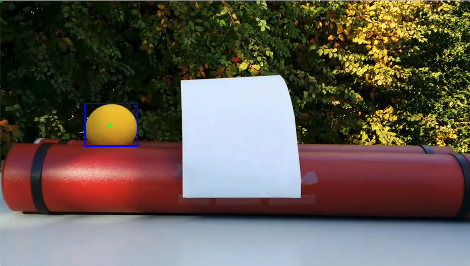

# CS-GY6613 Object Detecting Assignment

## Author: Xuanhua Zhang
## Table of Content
- [CS-GY6613 Object Detecting Assignment](#cs-gy6613-object-detecting-assignment)
  - [Author: Xuanhua Zhang](#author-xuanhua-zhang)
  - [Table of Content](#table-of-content)
  - [Quick Start](#quick-start)
  - [Kalman_Filter](#kalman_filter)
    - [Initialization](#initialization)
    - [predict](#predict)
    - [predict output](#predict-output)
    - [set state](#set-state)
    - [update](#update)
  - [Task1: Detect the objects “balls” in the image](#task1-detect-the-objects-balls-in-the-image)
  - [Task2/Task3: Tracking the objects](#task2task3-tracking-the-objects)
  - [Example Input](#example-input)
  - [Example Output](#example-output)

## Quick Start

Install all of the required packages
```console
pip3 install -r requirements.txt
```

Run 
```console
python3 script5.py <input Video Directory> <Output Video Directory>
```
For example
The input file is at: ./Inputs/ball.mp4
You want to output to: ./Outputs/result.mp4
```console
python3 script5.py ./Inputs/ball.mp4 ./Outputs/result.mp4
```
After excecuting the python, you should see a Video pop up on your screen.

## Kalman_Filter


### Initialization
```python
def __init__(self,center,v) :    
    self.X=np.append(center,v) #state vector
    self.P=np.eye(4) #posteriori estimate covariance matrix
    self.firsttime=0
    pass
```
### predict
``` python
    def predict(self,dt):

        F=np.array([         #state-transition matrix
            [1,0,dt,0],
            [0,1,0,dt],
            [0,0,1,0],
            [0,0,0,1]])
        Q=.01*np.eye(4)
        self.X=F.dot(self.X)
        self.P=F.dot(self.P).dot(F.T)+Q
```
### predict output
```python
    def predictoutput(self,dt): # return the prediction state 
            H=np.array([
                            [1,0,0,0],          #observation matrix
                            [0,1,0,0]
                        ])

            F=np.array([
                [1,0,dt,0],
                [0,1,0,dt],
                [0,0,1,0],
                [0,0,0,1]])

            return H.dot(F.dot(self.X))
```

### set state
```python
    def set_state(self,centers,vs): # set the state and p matrix only once 
        if self.firsttime==0:
            self.X=np.append(centers,vs)
            self.P=np.eye(4)
            self.firsttime=1
```
### update
```python
    def update(self,z,R):  # update p and x using new measurment z
        H=np.array([
            [1,0,0,0],
            [0,1,0,0]
        ])
        y=z-H.dot(self.X)  #z refer to measurment value 
        S=H.dot(self.P).dot(H.T)+R
        K=self.P.dot(H.T).dot(np.linalg.pinv(S))

        self.X=self.X+K.dot(y)
        self.P=(np.eye(4)-K.dot(H)).dot(self.P)

        pass
```
## Task1: Detect the objects “balls” in the image

- I use Yolo's pre-trained model to detect the balls in the image, the model detects many types of objects, in fact, the model recognizes the balls as orange! But since it serves the purpose, there is no objection to using it. The object number in the model is 49, so we choose the resulting objects that carry this number ,more details about the model from this link https://github.com/ultralytics/yolov5


## Task2/Task3: Tracking the objects

- I created an objects of Kalman filter to track the balls, each filter needs an initial state, when the ball objects are first detected, the coordinates are given to each filter and then the tracking process starts, when the positions of the balls are updated the new positions of the filter are assigned based on the distance, the filter whose state is closest The location of the ball object is given to him, and so on

## Example Input

(https://youtu.be/9TpcbKyzbyQ)
## Example Output

(https://youtu.be/X4K8dYbY4cI)